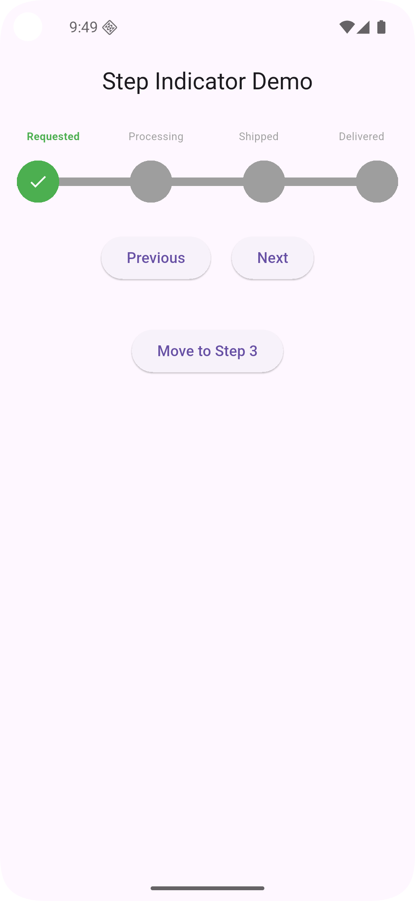

# Step Indicator Package

A highly customizable and interactive **step indicator widget** for Flutter applications.  
Perfect for representing multi-step workflows such as onboarding flows, form wizards, order tracking, and more!

<p align="center">
  
</p>

---

## ✨ Features

- 🎨 **Fully Customizable**: Adjust colors, icons, sizes, and text styles.
- 🖐️ **Interactive Steps**: Users can tap steps (or disable tap for controlled flow).
- 🔀 **Navigation Buttons**: Built-in "Next" and "Previous" navigation buttons.
- ⚡ **Dynamic Updates**: Instantly reflect user interactions and state changes.
- 🧠 **Reactive State Management**: Powered by [GetX](https://pub.dev/packages/get) for smooth and efficient updates.
- ⚙️ **Programmatic Control**: Jump to any step dynamically using the controller.
- 🛠️ **Flexible Initialization**: Set initial step easily and listen for step changes.

---

## 🚀 Getting Started

### Prerequisites

Add the required dependencies to your `pubspec.yaml`:

```yaml
dependencies:
  flutter:
    sdk: flutter
  get: ^4.6.5
```

---

### Installation

Run the following command:

```bash
flutter pub add step_indicator_package
```

Then, import it:

```dart
import 'package:step_indicator_package/step_indicator_package.dart';
```

---

## 🛠️ Usage

### Basic Example

```dart
import 'package:flutter/material.dart';
import 'package:step_indicator_package/step_indicator_package.dart';

void main() {
  runApp(const MyApp());
}

class MyApp extends StatelessWidget {
  const MyApp({super.key});

  @override
  Widget build(BuildContext context) {
    return MaterialApp(
      home: Scaffold(
        appBar: AppBar(title: const Text('Step Indicator Example')),
        body: Center(
          child: StepIndicator(
            steps: ["Step 1", "Step 2", "Step 3", "Step 4"],
            activeColor: Colors.blue,
            inactiveColor: Colors.grey,
            activeLineColor: Colors.blueAccent,
            inactiveLineColor: Colors.grey.shade300,
          ),
        ),
      ),
    );
  }
}
```

---

### Advanced Example

Control steps manually with a custom controller:

```dart
import 'package:flutter/material.dart';
import 'package:step_indicator_package/step_indicator_package.dart';

final controller = StepIndicatorController(
  maxSteps: 3,
  initialStep: 1,
  onStepChanged: (index) {
    debugPrint('Current Step Changed To: $index');
  },
);

StepIndicator(
  steps: ["Request", "Pending", "Confirmed", "Completed"],
  controller: controller,
  allowCircleTap: true, // Allow users to tap steps
  showNavigationButtons: true,
  previousButton: ElevatedButton(
    onPressed: controller.previousStep,
    child: const Text('Back'),
  ),
  nextButton: ElevatedButton(
    onPressed: controller.nextStep,
    child: const Text('Next'),
  ),
);
```

---

## 🎨 Customization Options

| Property             | Description                                  | Default                |
|----------------------|----------------------------------------------|------------------------|
| `steps`              | List of step labels                         | `["Request", "Pending", "Confirmed", "Completed"]` |
| `activeColor`        | Active step color                           | `Color(0xff003285)`    |
| `inactiveColor`      | Inactive step color                         | `Color(0xFFB0BEC5)`    |
| `activeLineColor`    | Active progress line color                  | `Color(0xFF1A237E)`    |
| `inactiveLineColor`  | Inactive progress line color                | `Color(0xFFE0E0E0)`    |
| `allowCircleTap`     | Enable/Disable tapping on steps             | `true`                 |
| `initialStep`        | Start the indicator from a specific step    | `0`                    |
| `onStepChanged`      | Callback when the current step changes      | `null`                 |
| `showNavigationButtons` | Show Next/Previous buttons              | `true`                 |
| `animationDuration`  | Duration for animation effects              | `300ms`                |

---

## 📦 Example Project

You can find a complete working example inside the `/example/` folder.  
Simply run:

```bash
cd example
flutter run
```

---

## 📈 Contributing

Contributions are welcome!  
Feel free to open issues or submit pull requests in the [GitHub repository](https://github.com/the-razib/step_indicator_package/issues).

---

## 📜 License

Distributed under the MIT License.  
See the [LICENSE](LICENSE) file for more information.

---

## 📚 Additional Resources

- Official Docs: [Pub.dev Page](https://pub.dev/packages/step_indicator_package)
- Author: [The Razib](https://github.com/the-razib)

---

